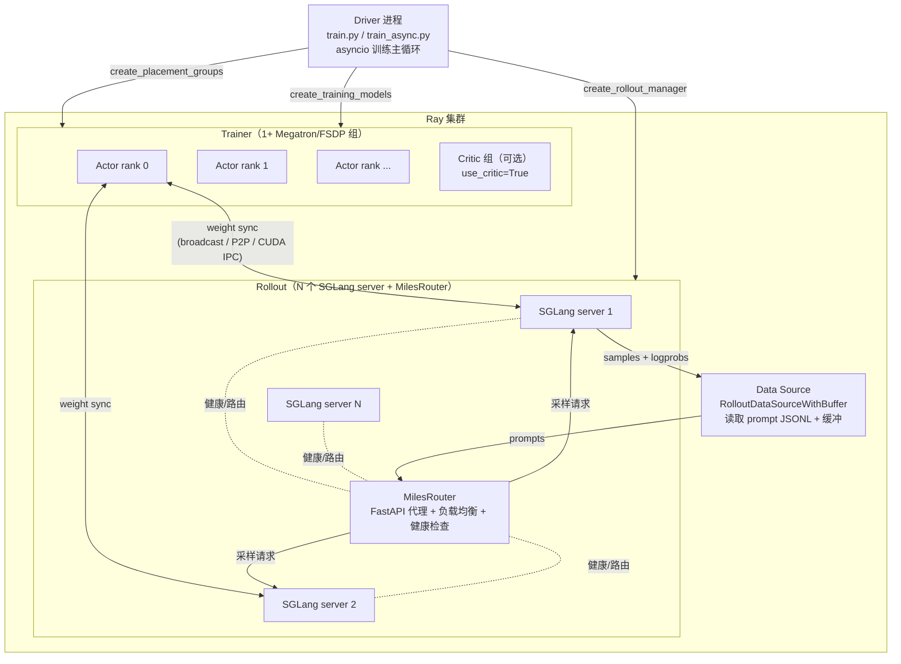
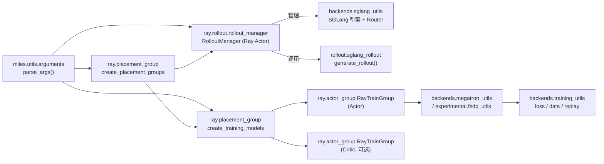
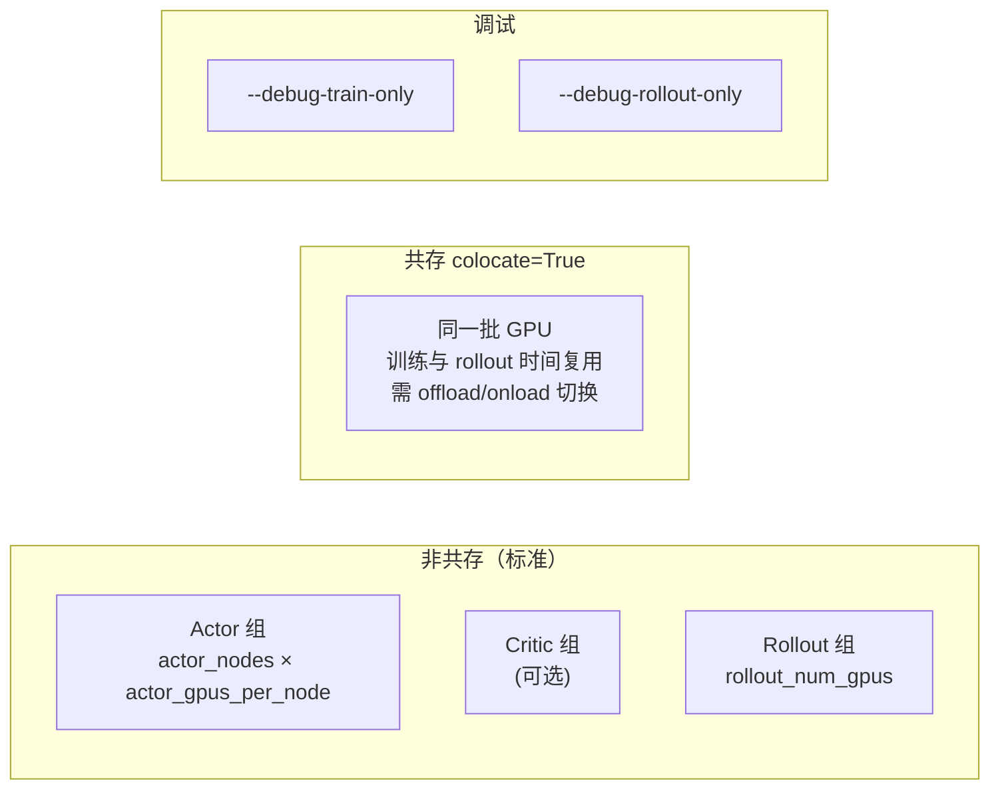
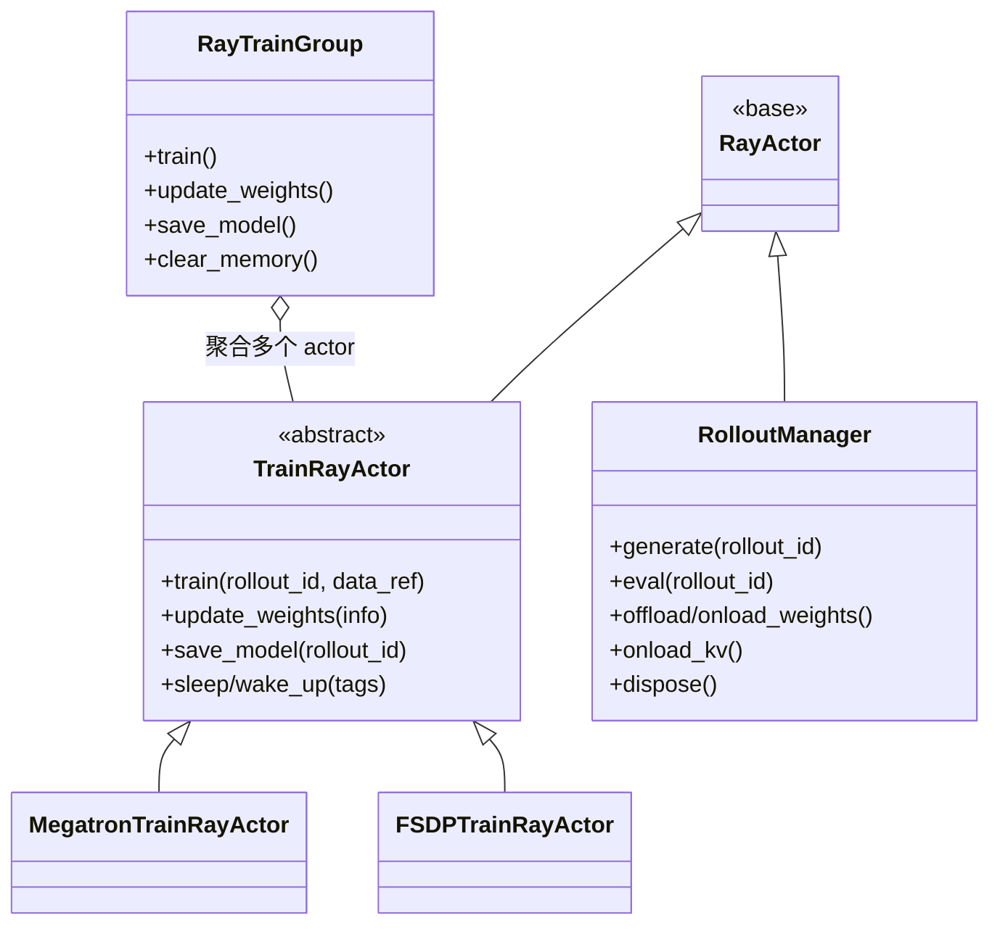

# 01 系统架构总览

## 1. 进程模型

一次 Miles 运行是包裹在 **Ray 集群**中的三类进程协作：

- **Driver**：`train.py` 的主循环，调度 rollout 与 train，做权重同步。
- **Trainer ranks**：每个 GPU 一个 `MegatronTrainRayActor` / `FSDPTrainRayActor`，加载 `torch_dist` 检查点，执行 RL 前向/反向。
- **SGLang servers**：独立 HTTP 服务，产出 rollout（支持 FP8/MXFP8 量化推理）。
- **MilesRouter**：FastAPI 代理，分发 rollout 请求、保留 R3 元数据、执行健康检查。
- **Data Source**：Trainer 持有的 Python 对象，读取 prompt JSONL，作为 rollout 与 training 之间的缓冲。

## 2. 顶层组件依赖

## 3. 包布局

```mermaid
flowchart TB
  subgraph MilesPkg["miles/"]
    Backends["backends/"]
    RayPkg["ray/"]
    RolloutPkg["rollout/"]
    RouterPkg["router/"]
    TrueOnPolicy["true_on_policy/"]
    UtilsPkg["utils/"]
  end

  Backends --> MU["megatron_utils/<br/>actor, model, initialize,<br/>update_weight/, checkpoint, lora_utils"]
  Backends --> SU["sglang_utils/<br/>sglang_engine, arguments, config"]
  Backends --> TU["training_utils/<br/>loss, data, loss_hub/,<br/>replay_data, log_utils"]
  Backends --> FSDP["experimental/fsdp_utils/<br/>(in progress)"]

  RayPkg --> RA["ray_actor / train_actor<br/>actor_group / placement_group"]
  RayPkg --> RRoll["rollout/<br/>rollout_manager, rollout_server,<br/>train_data_conversion"]

  RolloutPkg --> SG["sglang_rollout / sft_rollout /<br/>sleep_rollout / on_policy_distillation"]
  RolloutPkg --> Hubs["generate_hub / filter_hub / rm_hub"]
  RolloutPkg --> Sess["session/<br/>LinearTrajectory, sessions"]
  RolloutPkg --> InfRoll["inference_rollout/ (实验性重构)"]
  RolloutPkg --> DS["data_source.py / base_types.py"]

  RouterPkg --> RT["router.py<br/>MilesRouter"]
  TrueOnPolicy --> TOP["config / contracts / schema<br/>+ model_profiles"]
  UtilsPkg --> UArgs["arguments.py (巨型参数注册)"]
  UtilsPkg --> UD["distributed / fp8_kernel /<br/>replay_base / mask / seqlen_balancing /<br/>health_monitor / memory / timer ..."]
```

## 4. 三类 GPU 放置策略

`create_placement_groups(args)` 返回 `{"actor", "critic", "rollout"}` 三组放置组：

- **策略 PACK**：bundle `[{"GPU":1,"CPU":1}]`，尽量打包到同一节点。
- 通过 `InfoActor` 内省物理 GPU ID，按 node IP + GPU ID 排序得到稳定映射。
- 共存模式要求 `offload_train` / `offload_rollout` 配合，在 rollout 期间把训练权重/显存卸载到 CPU。

## 5. Ray Actor 类层次

- `RayTrainGroup`（`ray/actor_group.py`）管理一组训练 actor，把 `train()/update_weights()/save_model()` 广播到组内所有 rank，通过 NCCL + Gloo 协作分布式训练。
- 后端在 `actor_group.py:79-88` 按 `args.train_backend`（`megatron` / `fsdp`）选择具体实现。

## 6. 与官方 docs 的关系

| 官方文档 | 定位 | 本 Wiki 补充 |
| :--- | :--- | :--- |
| `docs/developer/architecture.md` | 30 分钟进程/包导览 | 组件依赖图、Actor 类层次、放置策略细化 |
| `docs/user-guide/concepts.md` | 四核心对象概念 | 内部数据流与调用链 |
| `docs/advanced/*` | 各高级特性怎么做 | 各特性在系统中如何串联 |
