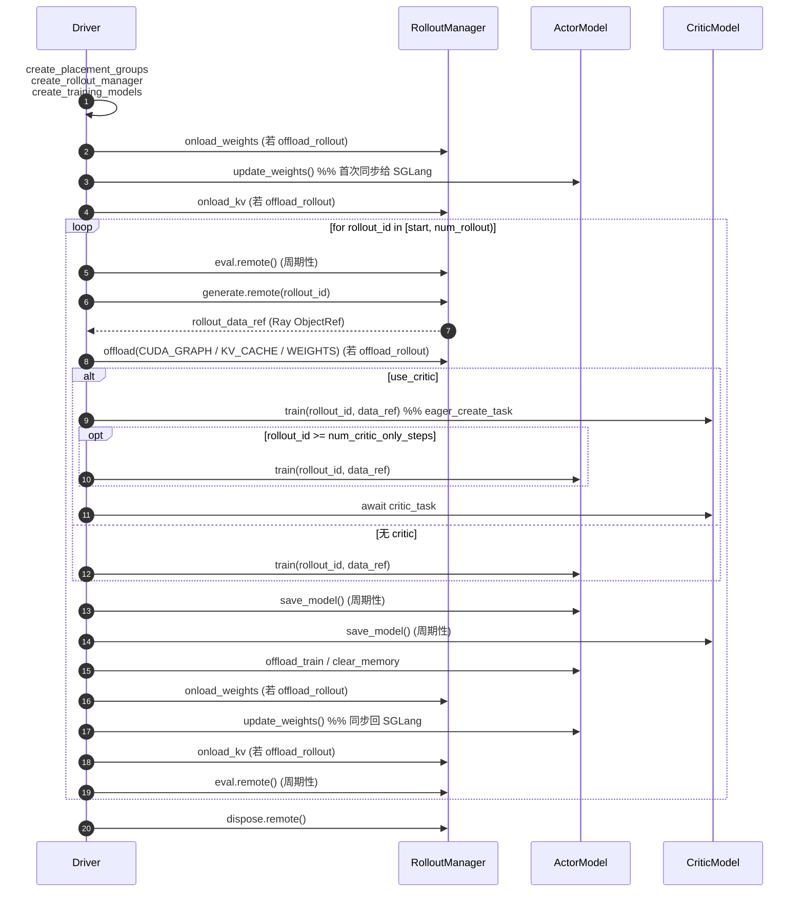
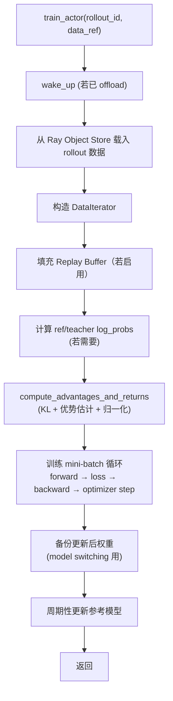
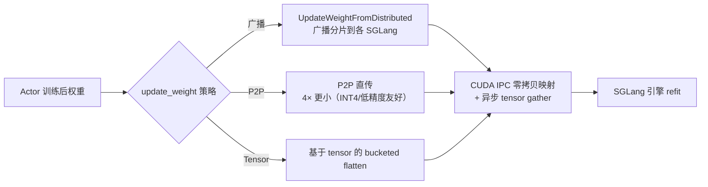
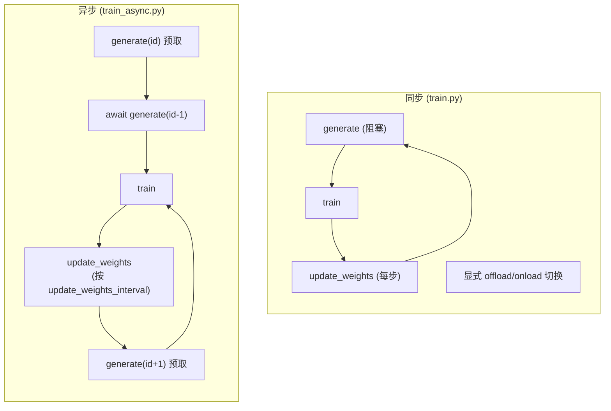
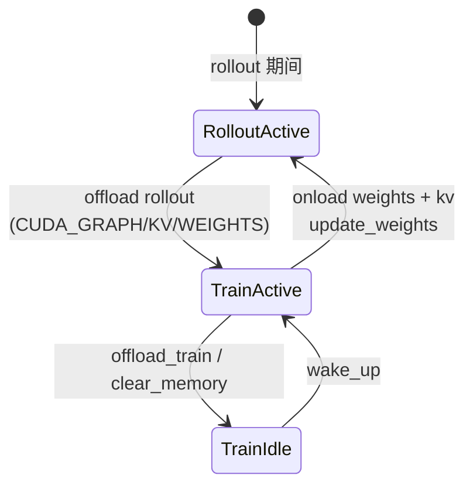
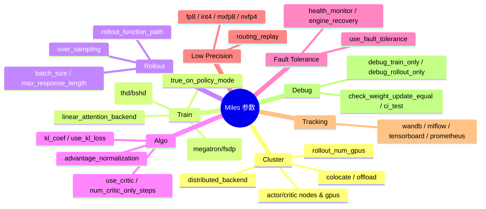

# 02 训练主循环

## 1. 同步训练循环（train.py）

`train.py` 的主循环（`train.py:69-102`）每个 `rollout_id` 执行一次完整的 generate → train → update 周期：

### 步骤说明

| 步骤 | 代码位置 | 说明 |
| :--- | :--- | :--- |
| 初始化 | `train.py:23-37` | 建放置组、RolloutManager、训练模型；首次 `update_weights()` 让 SGLang 拿到训练权重 |
| 生成 rollout | `train.py:73` | `rollout_manager.generate.remote()` 返回 `ObjectRef`，内部含转换好的训练数据 |
| 卸载 rollout 显存 | `train.py:75-81` | 按级别卸载 CUDA Graph / KV Cache / 权重到 CPU |
| 训练 | `train.py:83-89` | critic 先训（warm-up 阶段仅 critic），再训 actor；critic 用 `eager_create_task` 并发 |
| 保存 | `train.py:91-92` | `should_run_periodic_action` 按 save_interval 触发 |
| 卸载训练 | `train.py:94-99` | `offload_train` 把权重移到 CPU，否则 `clear_memory` |
| 权重同步 | `train.py:97` | `actor_model.update_weights()` 广播到所有 rollout 引擎 |
| 评估 | `train.py:101` | 周期性 `eval.remote()` |

## 2. Actor 单步训练内部（Megatron）

`backends/megatron_utils/actor.py` 的 `train_actor()`（约 319-420 行）内部流程：

- `train_critic()`（约 288-314 行）：前向取 value → 与 actor 同步（warm-up 后）→ 算优势 → 训练 value loss。
- `update_weights()`（约 465-519 行）：重载分布式组 → 连接新 rollout 引擎 → 按策略同步 → CI 校验 → 更新备份 tag。

## 3. 权重同步策略

- 零拷贝权重同步（CUDA IPC + 异步 gather + bucketed flatten）相比 HTTP/RPC 传输减少约 50% 同步时间。
- CI 模式下 `check_weights_equal` 校验训练与推理权重逐位一致。

## 4. 同步 vs 异步循环

| 维度 | 同步 `train.py` | 异步 `train_async.py` |
| :--- | :--- | :--- |
| Rollout 生成 | 阻塞 `await` | 预取下一个 rollout（`train_async.py:36,44`） |
| 权重更新时机 | 每个 rollout 后 | 可配置 `update_weights_interval` |
| offload/onload | 显式切换 CUDA Graph/KV/权重 | 移除（`assert not args.colocate`） |
| 显存压力 | 较低（有卸载点） | 较高（预取占用） |
| 适用 | 大模型需卸载、单机 | 多节点高带宽、显存充足 |
| 训练-推理重叠 | 否 | rollout 可与 training 重叠 |

## 5. 显存调度（offload 体系）

- 三类显存标签：`GPU_MEMORY_TYPE_CUDA_GRAPH`、`GPU_MEMORY_TYPE_KV_CACHE`、`GPU_MEMORY_TYPE_WEIGHTS`（来自 `sglang.srt.constants`）。
- `offload_rollout_level` 控制卸载哪些层级，支持共存模式下训练与推理分时复用同一批 GPU。

## 6. 参数大类（arguments.py）

`miles.utils.arguments` 中的主要参数组：

