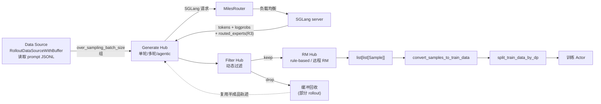
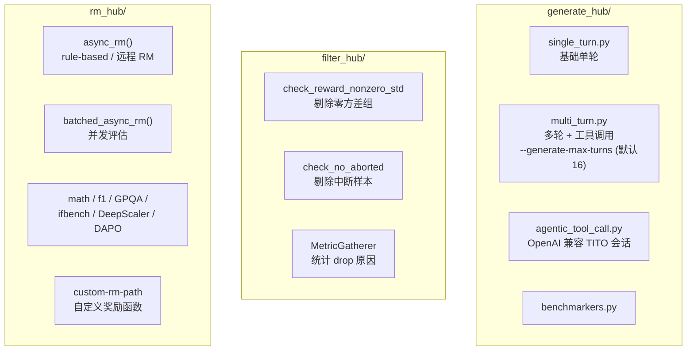
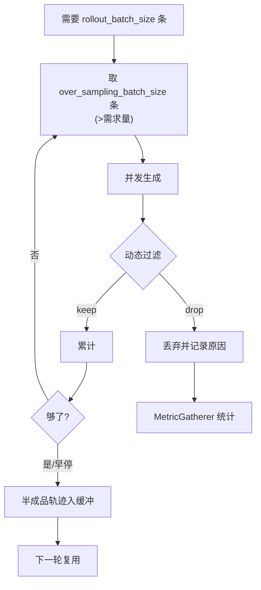
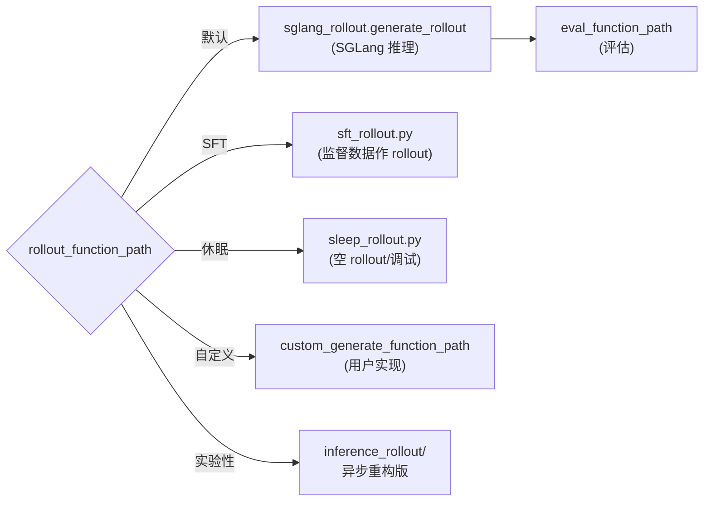
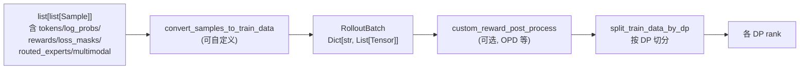

# 03 Rollout 管线

Rollout 是 Miles 的「采样 + 奖励」阶段，把 prompt 变成带 logprob/reward/routing 的训练样本。核心在 `miles/rollout/`。

## 1. 端到端 Rollout 数据流



## 2. 四大 Hub



- **Data Source**（`data_source.py:44-157`）：基于 epoch 洗牌、追踪 `sample_offset/epoch_id/sample_index`，保证确定性顺序；`WithBuffer` 变体保留被过滤样本以便复用。
- **Filter**：在 `sglang_rollout.py:442` 与 inference rollout 中应用，`DynamicFilterOutput` = `{keep: bool, reason: str}`。
- **RM**：`async_rm()`（30-66 行）分发到规则奖励或远程 RM；`batched_async_rm()`（69-90 行）并发。

## 3. SGLang Rollout 内部（sglang_rollout.py）

```mermaid
sequenceDiagram
  autonumber
  participant Loop as generate_rollout_async
  participant Gen as generate_and_rm
  participant SGLang
  participant RM as rm_hub

  Loop->>Loop: 取 over_sampling_batch_size 组样本
  Loop->>Gen: 提交异步任务（并发受 semaphore 限）
  Gen->>Gen: call_processor / tokenizer 编码<br/>(多模态 images)
  Gen->>SGLang: POST 采样 payload<br/>return_logprob=True<br/>top_logprobs_num (OPD)<br/>return_routed_experts (R3)<br/>X-SMG-Routing-Key (session 路由)
  SGLang-->>Gen: tokens + logprobs + routed_experts
  Gen->>RM: async_rm / batched_async_rm
  RM-->>Gen: reward
  Gen-->>Loop: Sample(s)

  Loop->>Loop: 动态过滤 (filter_hub)
  Loop->>Loop: 满 rollout_batch_size 即止
  Loop->>Loop: 早停 → 半成品入缓冲<br/>(partial rollout)
  Loop->>Loop: 通过 prefill 重算 logprob<br/>(保持训练策略对齐)
```

关键点：
- **`GenerateState` 单例**（62-130 行）：tokenizer/processor、并发 semaphore、采样参数。
- **DP Rank 负载均衡**（101-109 行）：按 min-count 把请求分到各 data-parallel worker。
- **一致哈希路由**：`X-SMG-Routing-Key` + `sample.session_id` 让同一会话命中同一 worker。
- **LoRA**：启用时设 `lora_path=LORA_ADAPTER_NAME`。
- **R3**：`return_routed_experts=True` 时，SGLang 返回 base64 numpy，解码为 `[num_tokens-1, num_layers, topk]`，存入 `sample.rollout_routed_experts`。

## 4. 过采样与部分 Rollout（解决长尾效应）



- 多轮 RL 中部分轨迹未完成会浪费 GPU；Miles 过采样并在早停时把半成品轨迹回收到 buffer，下一轮复用。
- 这就是 README 提到的 **Partial Rollout & Over-Sampling**。

## 5. Rollout 函数变体



## 6. 训练数据转换



`miles/utils/types.py` 定义 `RolloutBatch` / `RolloutSample` 等 Pydantic 模型承载上述字段。
