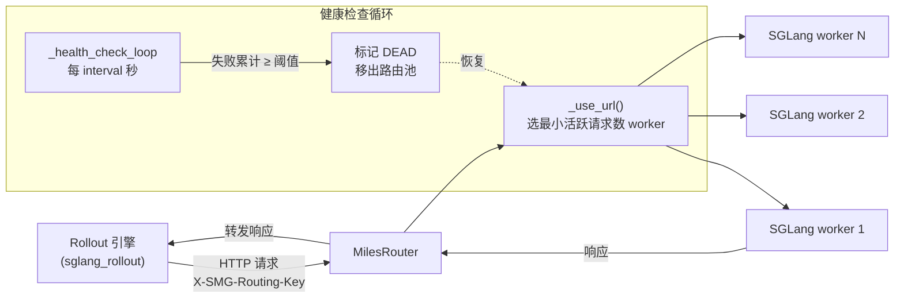
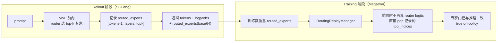
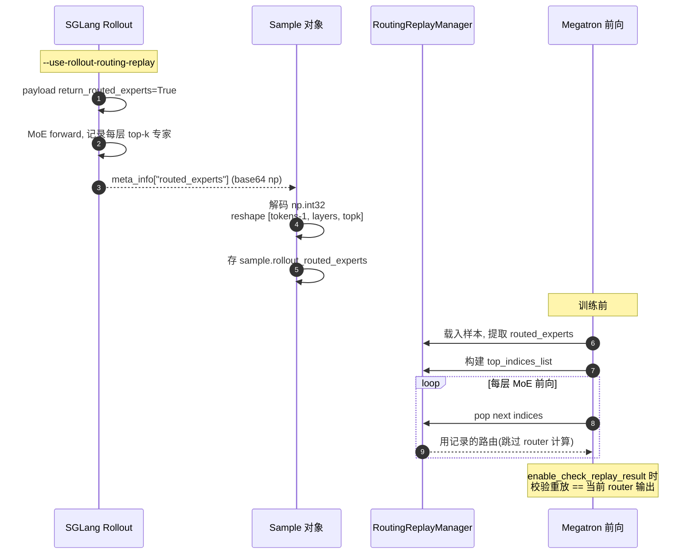
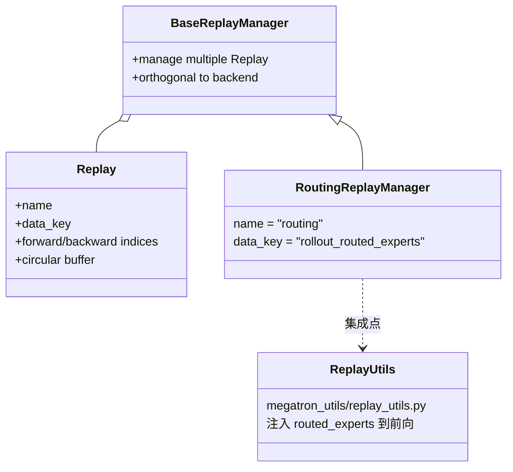
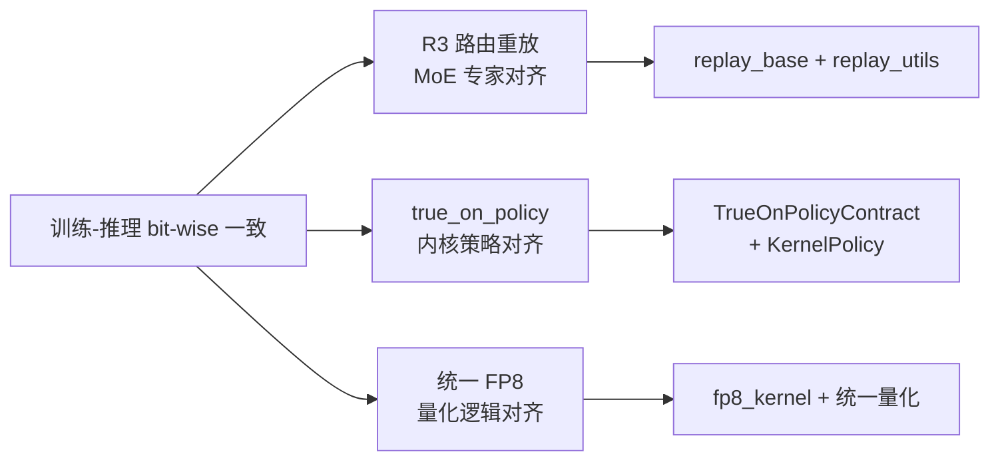

# 04 Router 与 R3 路由重放

## 1. MilesRouter：负载均衡 + 健康检查

`miles/router/router.py` 的 `MilesRouter`（34-233 行）是位于 rollout 客户端与 SGLang worker 池之间的 FastAPI 代理。

| 能力 | 实现位置 | 说明 |
| :--- | :--- | :--- |
| 负载均衡 | `router.py:211-226` | 选活跃请求最少的 worker |
| 健康检查 | `router.py:73-127` | 后台 async loop，连续失败达阈值标记 DEAD |
| 动态加 worker | `add_worker()` 177-205 | `/add_worker?url=...` |
| 列举 worker | `list_workers()` 207-209 | |
| 通用代理 | `router.py:129-175` | 透传请求/响应体 |

参数：`sglang_router_ip:port`、`sglang_server_concurrency`（每 worker 最大并发）、`miles_router_max_connections`（httpx 连接池）。

## 2. R3（Rollout Routing Replay）解决的问题

大 MoE 模型（Qwen3、DeepSeek-V3）在 RL 中易「训练-推理 mismatch」导致崩溃：推理时 MoE router 选的专家与训练时重算的不一致，造成 off-policy 偏差。**R3 记录推理时的路由决策，训练时重放，保证 bit-wise 专家对齐。**

## 3. R3 记录与重放时序

## 4. R3 基础设施

- 基础设施在 `miles/utils/replay_base.py`（`Replay` 循环缓冲 + `BaseReplayManager`），与具体路由后端正交。
- Megatron 集成点：`backends/megatron_utils/replay_utils.py` 在 MoE 前向注入记录的路由。

## 5. Router 元数据保留

MilesRouter 不仅做负载均衡，还**保留 R3 等元数据**透传，保证 routed_experts 等信息随响应回到 rollout 引擎。这与一致哈希（`X-SMG-Routing-Key`）配合，让多轮会话与路由重放在分布式 worker 下依然正确。

## 6. 相关：true_on_policy 子系统

`miles/true_on_policy/` 进一步从内核层面保证 SGLang rollout 与 Megatron/FSDP 训练的**权重精确对齐 + 确定性**，是 R3 之外的另一条「一致性」路径（见 [08 多轮与 VLM](./08-multi-turn-and-vlm.md) 与 `true_on_policy/config.py`）。

