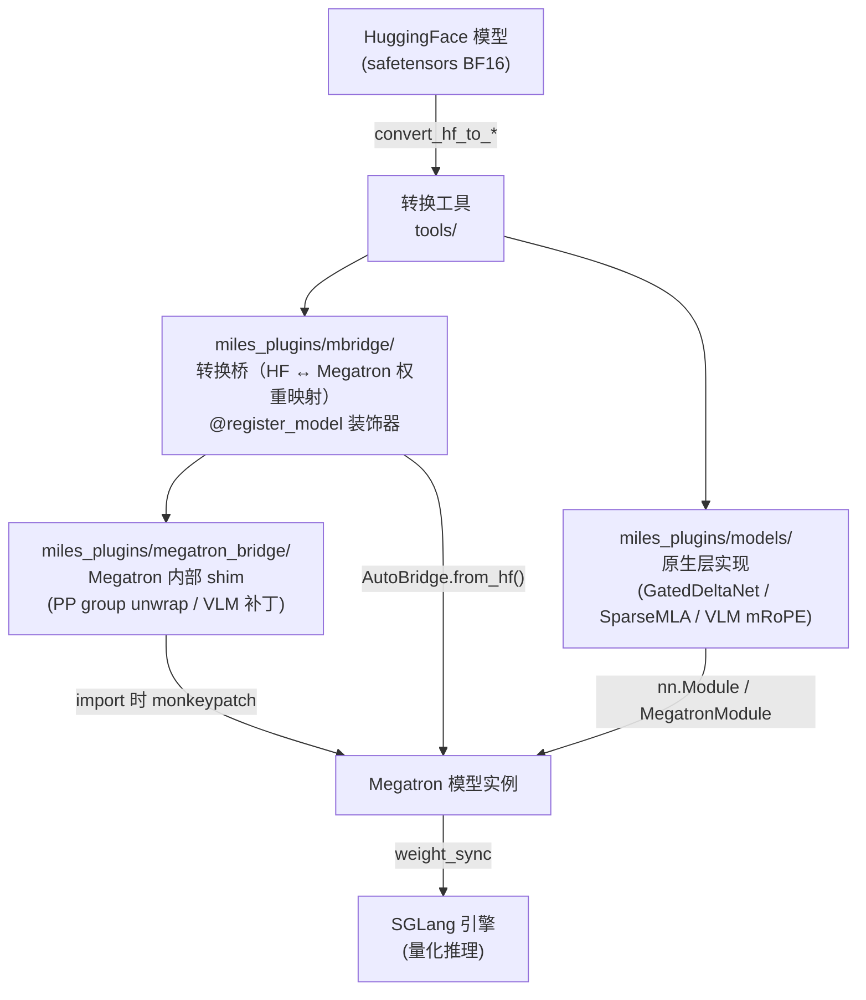
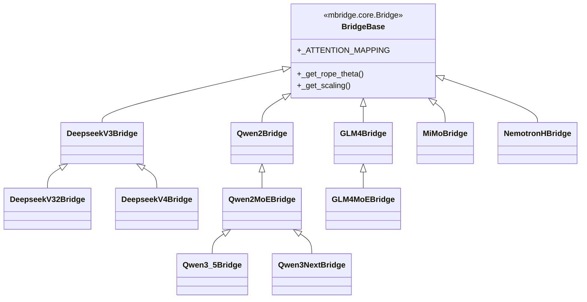
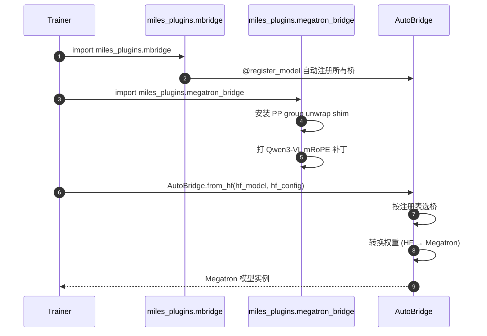
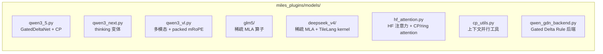
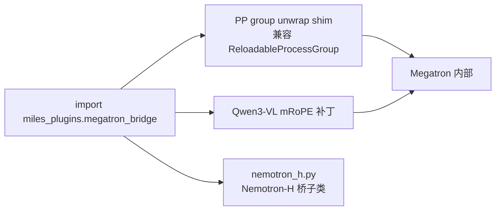

# 05 插件与模型桥接

Miles 通过三层插件架构支持 DeepSeek/Qwen/Llama/GLM/Kimi/Nemotron 等多模型族。代码在 `miles_plugins/`。

## 1. 三层架构

### 三层职责对比

| 层 | 路径 | 职责 | 继承自 |
| :--- | :--- | :--- | :--- |
| **mbridge** | `miles_plugins/mbridge/` | 转换桥：HF↔Megatron 权重名映射、RoPE/缩放配置 | 上游 `mbridge.core.Bridge` |
| **models** | `miles_plugins/models/` | 原生层实现：自定义算子（GDN、稀疏 MLA、VLM mRoPE） | `nn.Module` + Megatron `MegatronModule` |
| **megatron_bridge** | `miles_plugins/megatron_bridge/` | Megatron shim：monkeypatch 进程组、VLM 扩展 | mbridge.bridge |

## 2. mbridge 模型注册

每个桥通过 `@register_model("name")` 注册，提供 `_ATTENTION_MAPPING`（HF↔Megatron 参数名映射）与架构特定配置。

## 3. 插件加载链

## 4. 原生模型实现（models/）

- `qwen3_vl.py`：处理 packed mRoPE 位置（见近期 commit `803016a` 修复 Qwen3-VL THD packed mRoPE）。
- `deepseek_v4/`：含自定义 TileLang kernel 的稀疏 MLA。
- `hf_attention.py`：为 CP（上下文并行）+ ring attention 包装 HF 注意力。

## 5. Megatron shim（megatron_bridge/）

- `__init__.py` 在 import 时自动应用 best-effort shim。
- 解决 Megatron 与 Miles 可重载进程组（`reloadable_process_group.py`）的兼容问题。

## 6. 模型族 → 桥/原生实现 映射

| 模型族 | mbridge 桥 | 原生 models/ | 备注 |
| :--- | :--- | :--- | :--- |
| DeepSeek V3/V3.2/V4/R1 | `deepseek_v32`, `deepseekv4` | `deepseek_v4/` | DSA / 稀疏 MLA |
| Qwen 2/2.5/3 | `qwen3_5` (基类链) | `qwen3_5.py` | GatedDeltaNet |
| Qwen3-Next | `qwen3_next` | `qwen3_next.py` | thinking |
| Qwen3-VL | — | `qwen3_vl.py` | packed mRoPE |
| GLM 4/4.5/4.6/4.7/5 | `glm4`, `glm4moe`, `glm4moe_lite` | `glm5/` | 稀疏 MLA |
| Kimi K2/Moonlight | — | (走通用桥) | INT4 QAT 友好 |
| Nemotron-H | `megatron_bridge/nemotron_h` | — | |
| MiMo-7B | `mimo` | — | 继承 Qwen2Bridge |
| gpt-oss | — | — | SGLang/Megatron 通用支持 |

> 新增模型流程：写一个继承合适父桥的类 + `@register_model` → 必要时在 `models/` 加原生算子 → 用 `tools/convert_hf_to_torch_dist.py` 转检查点。
