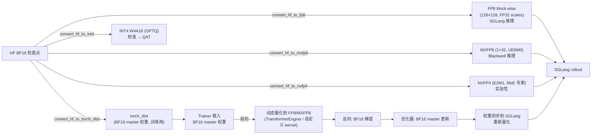
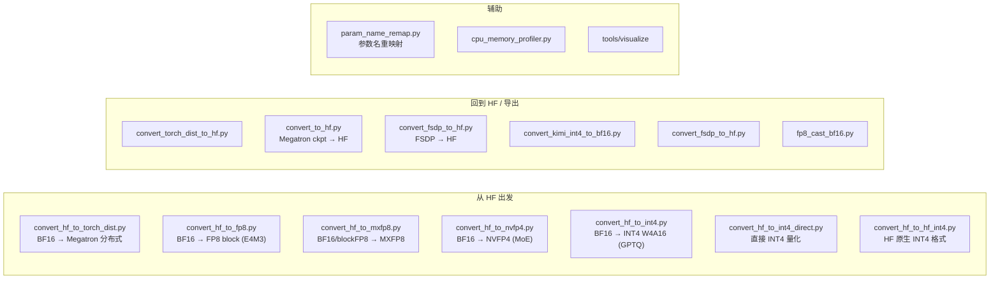
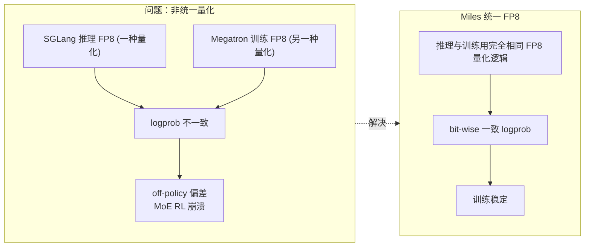
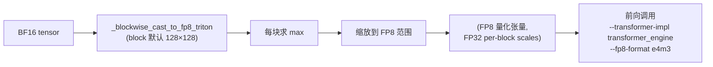
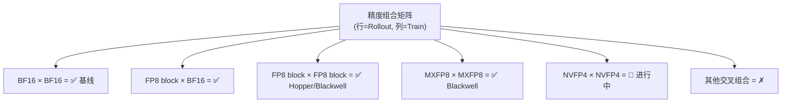
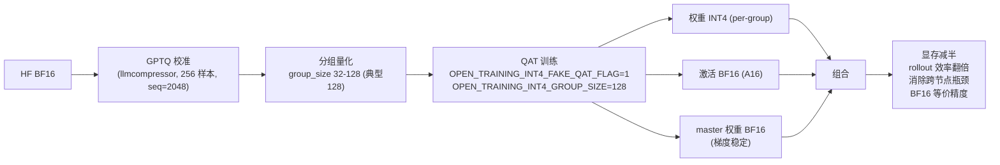
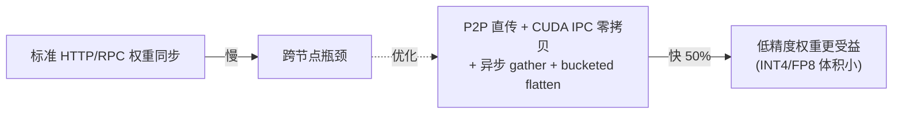

# 06 低精度训练

Miles 的核心卖点之一：**端到端低精度**，消除训练-推理量化差异导致的 RL 崩溃。涉及 FP8 / MXFP8 / NVFP4 / INT4 QAT。

## 1. 精度管线总览

## 2. 转换工具链（tools/）

| 工具 | 输入 → 输出 | 用途 |
| :--- | :--- | :--- |
| `convert_hf_to_torch_dist` | HF safetensors → torch_dist | 基线转换，训练加载 |
| `convert_hf_to_fp8` | BF16 → FP8 block (128×128, FP32 scale) | SGLang 推理 |
| `convert_hf_to_mxfp8` | BF16/块FP8 → MXFP8 (1×32, UE8M0) | Blackwell 推理 |
| `convert_hf_to_nvfp4` | BF16 → NVFP4 (E2M1, 仅 MoE 专家) | 实验性, Blackwell |
| `convert_hf_to_int4` | BF16 → INT4 W4A16 (GPTQ 分组) | 校准 → QAT |
| `convert_hf_to_int4_direct` | BF16 → INT4 直接量化 | 直接量化 |
| `convert_hf_to_hf_int4` | BF16 → HF INT4 格式 | HF 原生 |
| `convert_torch_dist_to_hf` | torch_dist → HF | 反向 |
| `convert_to_hf` | Megatron ckpt → HF | 训练导出 |
| `convert_fsdp_to_hf` | FSDP → HF | FSDP 导出 |
| `convert_kimi_int4_to_bf16` | Kimi INT4 → BF16 | 模型专用 upcast |

## 3. 统一 FP8：为什么重要

- 统一 FP8 + R3 + true_on_policy 共同消除 train-inference mismatch。
- 见 `docs/advanced/fp8-low-precision.md`。

## 4. FP8 kernel

`miles/utils/fp8_kernel.py`（80 行）：

## 5. 精度兼容性矩阵

## 6. INT4 QAT 流程（W4A16）

受 Kimi K2-Thinking 启发，让 1TB+ 模型塞进单机（如 H200）。

INT4 QAT 常与 **R3 路由重放 + P2P 权重传输（权重小 4×）+ 投机解码** 组合使用。

## 7. P2P 权重传输

见 `docs/advanced/p2p-weight-transfer.md`。

## 8. 关键文件索引

| 文件 | 作用 |
| :--- | :--- |
| `miles/utils/fp8_kernel.py` | Triton blockwise FP8 量化 |
| `tools/convert_hf_to_*.py` | 各精度转换 |
| `miles/utils/replay_base.py` | R3 路由重放基础设施 |
| `miles/true_on_policy/` | 内核级一致性策略 |
| `docs/advanced/fp8-low-precision.md` | FP8/MXFP8/NVFP4 文档 |
| `docs/advanced/int4-qat.md` | INT4 QAT 文档 |
