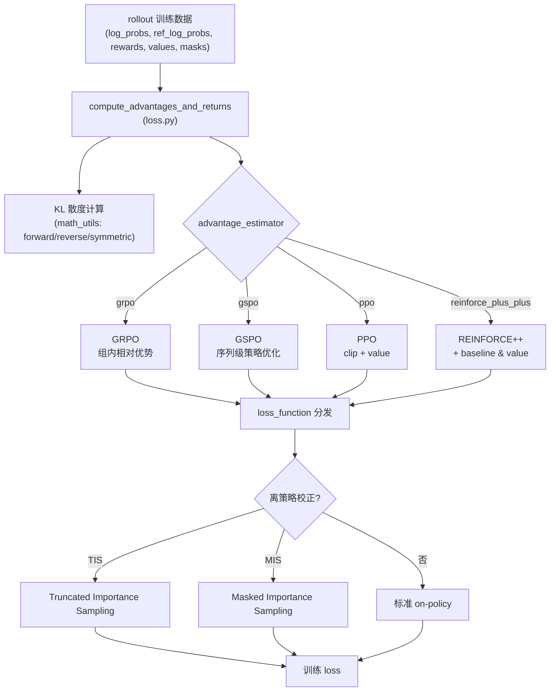
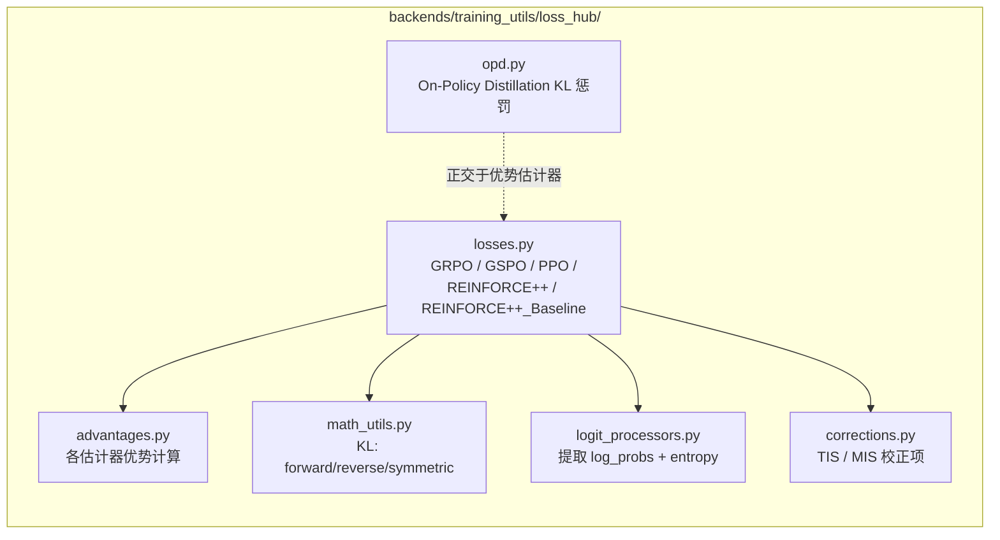
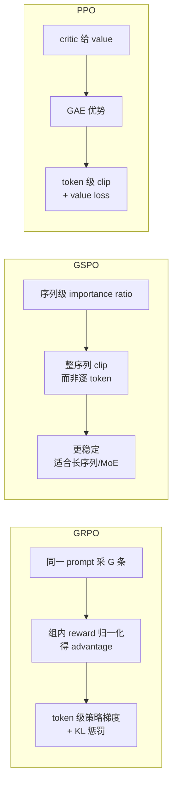
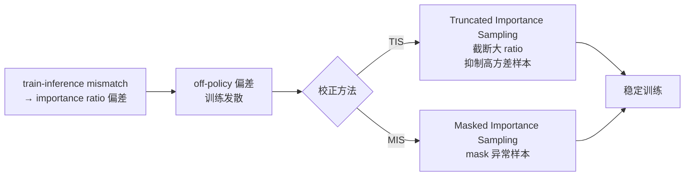
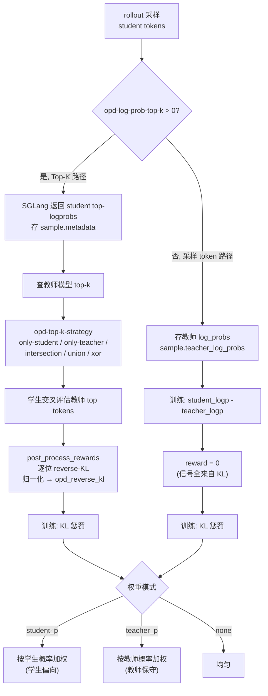
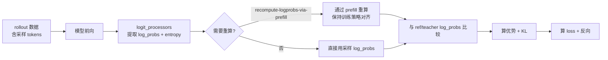

# 07 RL 算法与损失

算法实现在 `miles/backends/training_utils/`，核心是优势估计 + 损失分发 + 离策略校正。

## 1. 算法分发总览



## 2. loss_hub 模块结构



## 3. 优势估计器决策树

```mermaid
flowchart TD
  Start["选择 advantage_estimator"] --> Q1{有 critic / value?}
  Q1 -->|是| Q2{需要 clip 机制?}
  Q1 -->|否| Q3{组内可比较?<br/>(同一 prompt 多采样)}
  Q2 -->|是| PPO["ppo<br/>PPO clip + value loss"]
  Q2 -->|否, 用 baseline| RPP["reinforce_plus_plus<br/>REINFORCE + baseline & value"]
  Q3 -->|是, 组内相对| Q4{序列级 vs token 级?}
  Q3 -->|否| REINF["reinforce<br/>纯 REINFORCE"]
  Q4 -->|序列级| GSPO["gspo<br/>序列级策略优化<br/>更稳定"]
  Q4 -->|token 级| GRPO["grpo<br/>组内相对优势<br/>默认常用"]
```

> `AdvantageEstimator` 枚举定义在 `miles/utils/arguments.py`，包括 `grpo / gspo / ppo / reinforce_plus_plus / reinforce` 等。

## 4. GRPO vs GSPO vs PPO 对比



| 算法 | 需要 critic | 优势粒度 | clip 粒度 | 适用 |
| :--- | :--- | :--- | :--- | :--- |
| GRPO | 否 | 组内 token 级 | — | 通用默认，数学/推理 |
| GSPO | 否 | 序列级 | 序列级 | 长序列、MoE 稳定性 |
| PPO | 是 | GAE token 级 | token 级 | 有 value 函数场景 |
| REINFORCE++ | 可选 baseline | token 级 | — | 轻量基线 |

## 5. 离策略校正：TIS / MIS

当 train-inference mismatch 不可避免时（如低精度、非完全 on-policy），用算法校正防止发散：



- 与 `examples/train_infer_mismatch_helper/` 对应，提供 TIS/MIS 的算法实现与示例。
- 与系统级方案（统一 FP8、R3、true_on_policy）互补：系统级消除 mismatch，算法级兜底。

## 6. On-Policy Distillation (OPD)

`miles/rollout/on_policy_distillation.py` — 用教师模型最小化 reverse-KL，无需显式任务奖励。



- OPD **正交于优势估计器**：可叠加在 GRPO/GSPO/PPO 之上。
- `--opd-type`（megatron / rollout）选择 KL 在哪一侧计算。
- 见 `examples/on_policy_distillation/`。

## 7. 训练前向中的 log-prob 计算



## 8. 多轮损失掩码

`miles/utils/mask_utils.py` 的 `MultiTurnLossMaskGenerator` 按 chat template（如 Qwen）生成多轮 loss mask：仅对 assistant 回复 token 计 loss，工具调用/用户轮次 mask 掉。
