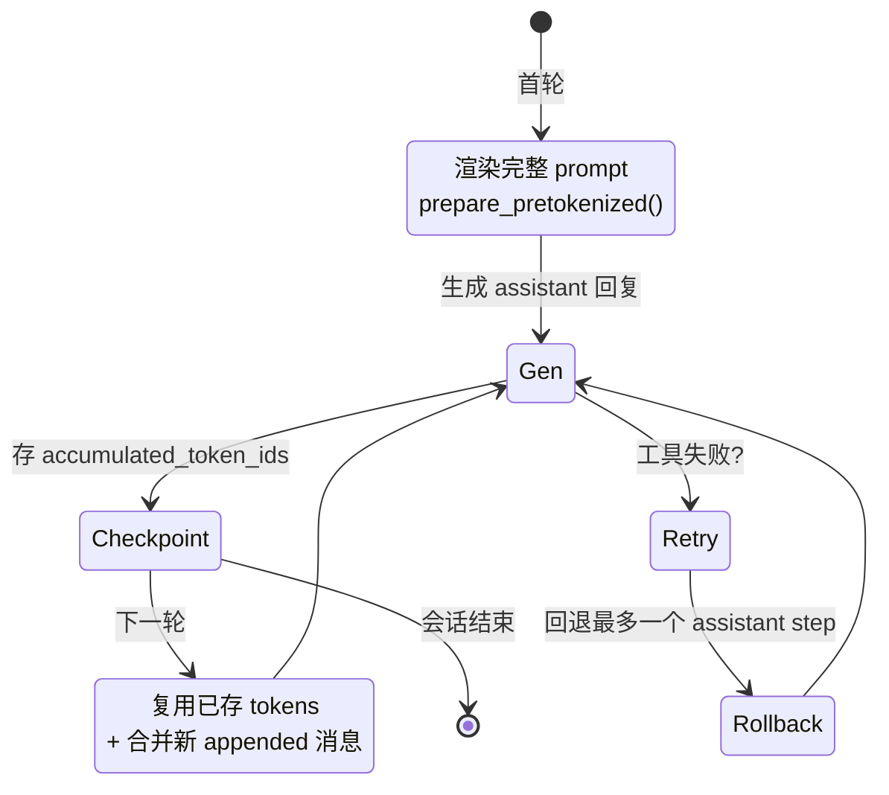
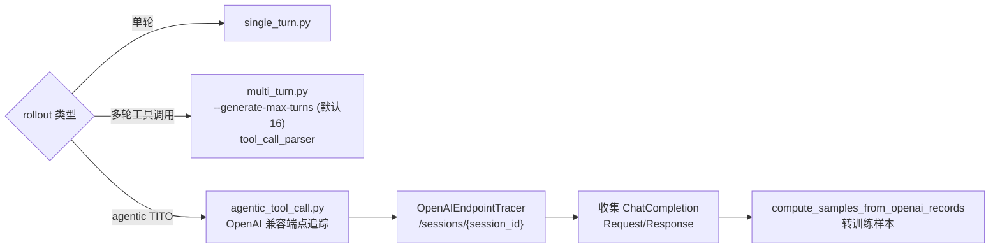
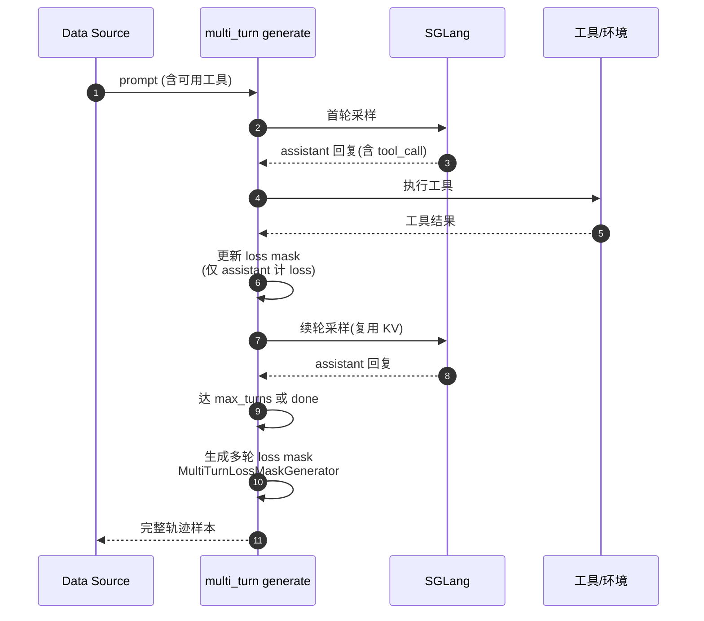
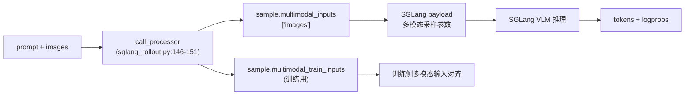
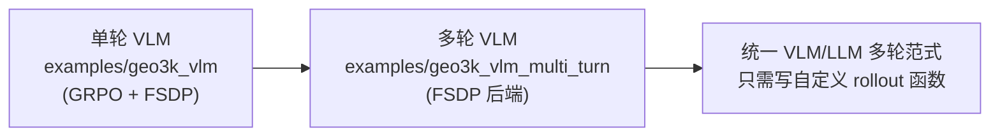
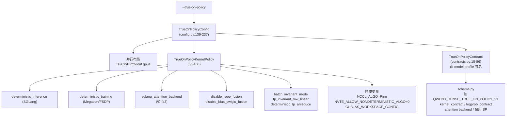
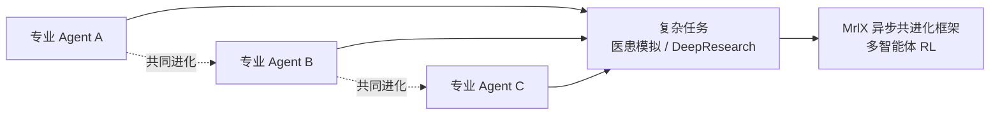

# 08 多轮交互与 VLM

## 1. 多轮会话：TITO（Token In, Token Out）

`miles/rollout/session/` 管理多轮交互的完整状态，避免每轮重算整个上下文。

- `LinearTrajectory`（`linear_trajectory.py:20-127`）维护消息历史 `[system?, user, assistant, tool, assistant, tool, …]` 与每步的 `accumulated_token_ids` 检查点。
- `SessionRegistry`（`linear_trajectory.py`）按 ID 管理会话。
- `prepare_pretokenized()`：首轮渲染完整 prompt；后续轮复用存储 tokens + 合并新消息。
- `update_pretokenized_state()`：生成后存新检查点。

## 2. 生成 Hub 中的多轮入口

- `agentic_tool_call.py:35-129` 的 `OpenAIEndpointTracer` 把多轮 agent 函数调用追踪为训练样本。
- `multi_turn.py:23-77` 支持多采样跟踪与工具调用解析。

## 3. 多轮 RL 流程

## 4. VLM（视觉语言模型）采样

- 处理器输出同时供给 rollout（推理）与 training（训练），保证两侧多模态输入一致。
- `miles_plugins/models/qwen3_vl.py` 处理 packed mRoPE 位置编码（THD 格式），近期 commit `803016a` 修复了 Qwen3-VL THD packed mRoPE。

## 5. VLM 多轮

- README「Unified VLM/LLM Multi-Turn Training」：开发者只写自定义 `rollout` 函数即可启动 VLM 多轮 RL，与 LLM 一致。

## 6. true_on_policy 子系统

`miles/true_on_policy/` 从内核层面保证 SGLang rollout 与 Megatron/FSDP 训练的 log-prob 严格相等。

- 当 `train_tensor_parallel_size > 1` 或 `rollout_num_gpus_per_engine > 1` 时，要求 **TP-invariant rollout**。
- SGLang target：`fsdp`（无 TP）或 `fsdp_tp`（有 TP）。
- `kernel_policy_kwargs_for()` 把 contract 适配到 train backend + sglang target。
- `examples/true_on_policy/` 与 `examples/true_on_policy_vlm/` 提供演示。

## 7. 多智能体共进化（MrlX）

- README「Multi-Agent Co-Evolution」：支持 MrlX 异步共进化框架，多智能体共生进化。
- 见 `examples/multi_agent/`。
