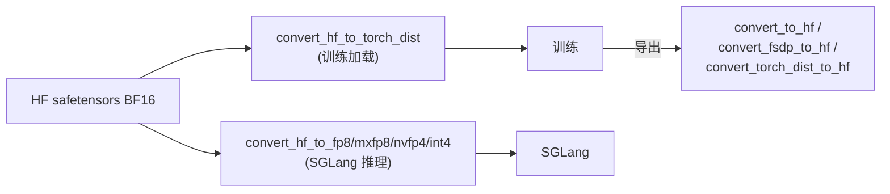
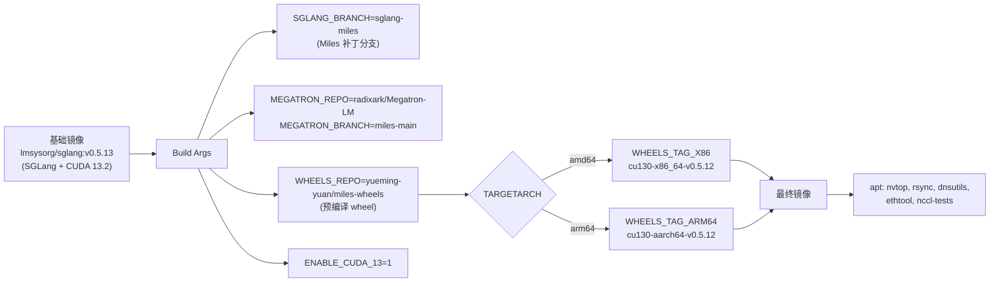
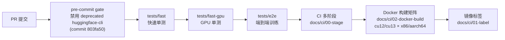
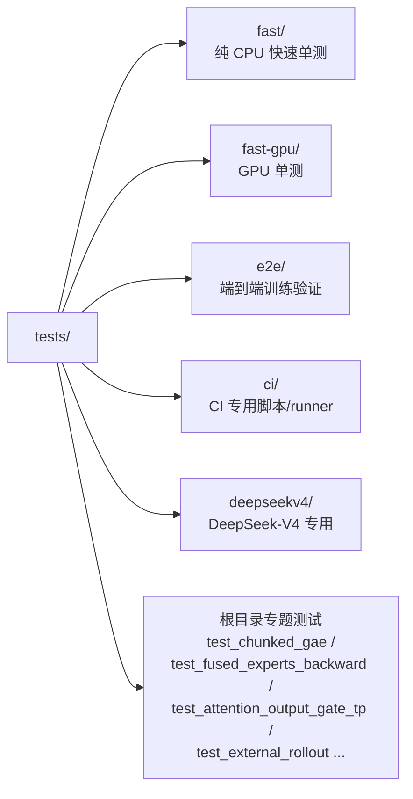
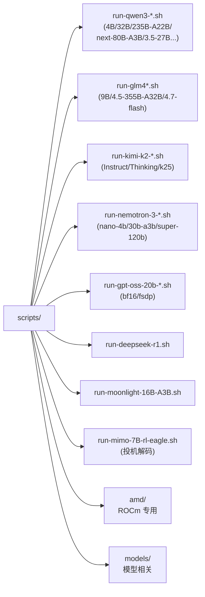
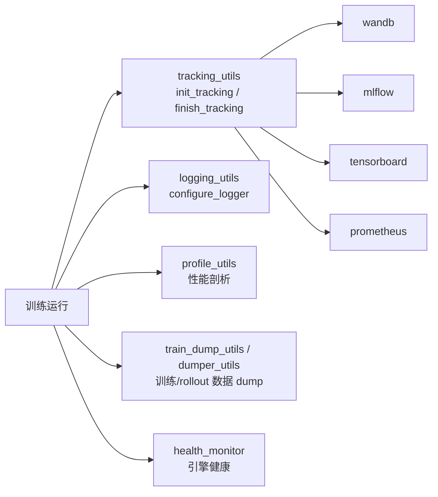
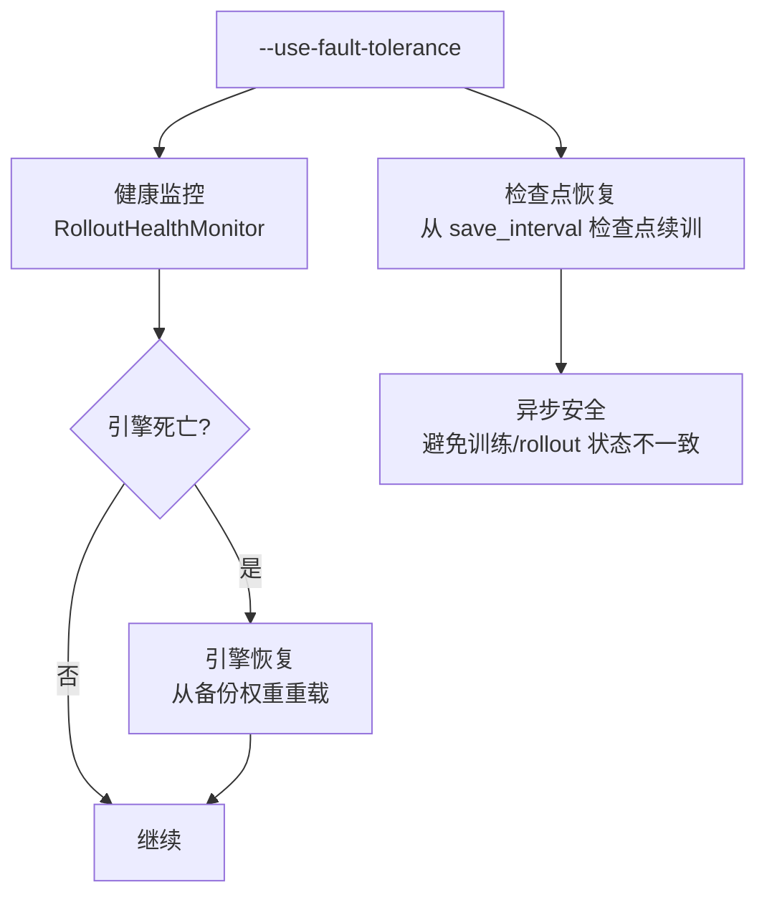
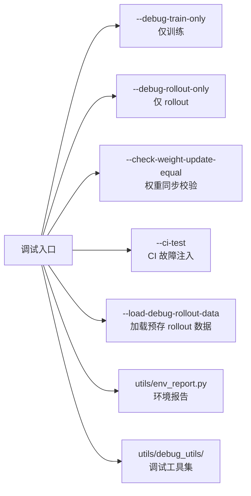

# 09 工具链与基础设施

## 1. 关键 utils 子系统

```mermaid
graph LR
  subgraph Utils["miles/utils/"]
    Args["arguments.py<br/>巨型参数注册"]
    Dist["distributed_utils.py<br/>Gloo 组 / masked whiten"]
    Fp8["fp8_kernel.py<br/>Triton FP8 量化"]
    Replay["replay_base.py<br/>R3 路由重放缓冲"]
    Mask["mask_utils.py<br/>多轮 loss mask"]
    Seq["seqlen_balancing.py<br/>Karmarkar-Karp 负载均衡"]
    Health["health_monitor.py<br/>SGLang 引擎健康检查"]
    Mem["memory_utils.py<br/>GPU/Host 显存追踪"]
    TB["tensor_backper.py<br/>检查点 tensor 备份/恢复"]
    Timer["timer.py"]
    Track["tracking_utils/<br/>wandb/mlflow/tensorboard/prom"]
    Types["types.py<br/>RolloutBatch/Sample (Pydantic)"]
    Async["async_utils.py<br/>eager_create_task"]
  end
```

| 文件 | 作用 |
| :--- | :--- |
| `distributed_utils.py` | Gloo 组初始化、`distributed_masked_whiten`（跨 DP rank 优势归一化）、自定义进程组 |
| `replay_base.py` | `Replay` 循环缓冲（前向/反向索引分离）+ `BaseReplayManager`，R3 基础 |
| `seqlen_balancing.py` | Karmarkar-Karp 算法把序列均衡分配到各 worker，避免长尾 |
| `health_monitor.py` | `RolloutHealthMonitor` 线程化检查 SGLang 引擎健康 |
| `mask_utils.py` | `MultiTurnLossMaskGenerator`（Qwen chat template） |
| `tensor_backper.py` | `TensorBackuper`（CPU pinned memory 备份/恢复 tensor，用于 model switching） |
| `memory_utils.py` | GPU/host 显存追踪 + `torch.cuda.empty_cache()` 包装 |
| `types.py` | Pydantic 模型：`RolloutBatch`、`RolloutSample` 等 |
| `reloadable_process_group.py` | 可重载进程组（与 megatron_bridge shim 配合） |
| `metric_checker.py` / `metric_utils.py` | 指标校验与聚合 |

## 2. 权重/精度转换工具链

见 [06 低精度训练](./06-low-precision.md)。核心流向：

辅助：`param_name_remap.py`（参数名重映射）、`cpu_memory_profiler.py`、`tools/visualize`（可视化）。

## 3. Docker 镜像

`docker/Dockerfile`（250+ 行），多架构（x86 / aarch64）：

- 构建：`python docker/build.py --variant cu13 --image-tag dev --push`
- AMD 变体：`Dockerfile.rocm`（MI300X/MI325 ROCm 栈）
- NPU 支持：`npu_patch/`（Ascend）
- AMD 补丁：`amd_patch/`

## 4. CI 流水线

`docs/ci/` + `tests/ci/` + `.github/`：

测试目录结构：

## 5. 启动脚本（scripts/）

`scripts/` 含 40+ 各模型启动脚本，按模型族组织：

## 6. 追踪与监控

## 7. 容错与恢复

- `--use-resilient-compression`：容错下的压缩传输。
- 见 `docs/advanced/fault-tolerance.md`。

## 8. 调试工具

