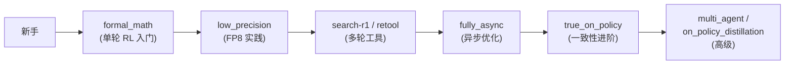
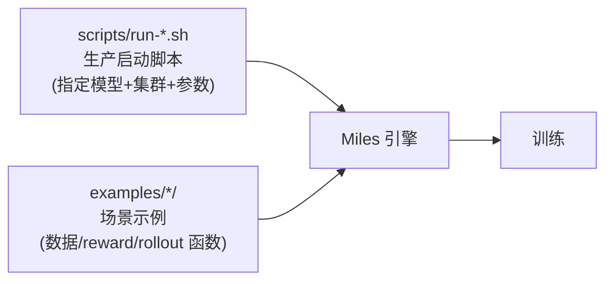

# 10 示例目录导览

`examples/` 提供 RL 场景的可运行示例，多数带可验证性能分数。来源：`examples/README.md`。

## 1. 示例能力矩阵

```mermaid
flowchart TD
  Ex["examples/"] --> Alg["算法类"]
  Ex --> Scenario["场景类"]
  Ex --> Infra["系统/精度类"]

  Alg --> DrGRPO["DrGRPO<br/>自定义 reducer"]
  Alg --> OPD["on_policy_distillation<br/>OPD 蒸馏"]
  Alg --> Mismatch["train_infer_mismatch_helper<br/>TIS / MIS 校正"]

  Scenario --> Math["formal_math<br/>形式化数学"]
  Scenario --> Search["search-r1<br/>多轮 + 工具调用树搜索"]
  Scenario --> Retool["retool / retool_v2<br/>工具增强生成"]
  Scenario --> Tau["tau-bench<br/>agentic 多轮工具环境"]
  Scenario --> Strands["strands_sglang<br/>Strands-Agents 框架集成"]
  Scenario --> Multi["multi_agent<br/>多智能体 RL (MrlX)"]

  Infra --> Async["fully_async / random_async<br/>异步 rollout"]
  Infra --> Low["low_precision<br/>FP8 训练推理"]
  Infra --> LoRA["lora<br/>LoRA 训练与 serving"]
  Infra --> Top["true_on_policy /<br/>true_on_policy_vlm<br/>bit-wise 一致"]
  Infra --> P2P["p2p_weight_transfer<br/>P2P 权重同步"]
  Infra --> Repro["reproducibility<br/>确定性复现"]
  Infra --> VLM["geo3k_vlm /<br/>geo3k_vlm_multi_turn<br/>VLM GRPO"]
  Infra --> Eval["eval / eval_multi_task<br/>NeMo-Skills / OOD 评估"]
```

## 2. 示例 → 系统能力映射

| 示例 | 演示的核心能力 | 对应 Wiki 章节 |
| :--- | :--- | :--- |
| `DrGRPO` | 自定义 reducer / 算法扩展 | [07 算法](./07-algorithms.md) |
| `on_policy_distillation` | OPD teacher-student KL | [07 算法](./07-algorithms.md) |
| `train_infer_mismatch_helper` | TIS / MIS 离策略校正 | [07 算法](./07-algorithms.md) |
| `formal_math` | 单轮数学推理 RL | [03 Rollout](./03-rollout-pipeline.md) |
| `search-r1` | 多轮会话 + 工具调用 | [08 多轮](./08-multi-turn-and-vlm.md) |
| `retool` / `retool_v2` | 工具增强生成 | [08 多轮](./08-multi-turn-and-vlm.md) |
| `tau-bench` | agentic 多轮工具环境 | [08 多轮](./08-multi-turn-and-vlm.md) |
| `strands_sglang` | Strands-Agents 脚手架集成 | [08 多轮](./08-multi-turn-and-vlm.md) |
| `multi_agent` | 多智能体共进化 MrlX | [08 多轮](./08-multi-turn-and-vlm.md) |
| `fully_async` / `random_async` | 异步 rollout 驱动 | [02 训练循环](./02-training-loop.md) |
| `low_precision` | FP8 训练与推理 | [06 低精度](./06-low-precision.md) |
| `lora` | LoRA 训练 + serving | [05 插件](./05-plugins-and-models.md) |
| `true_on_policy` / `true_on_policy_vlm` | bit-wise 一致 logprob | [08 多轮/VLM](./08-multi-turn-and-vlm.md) |
| `p2p_weight_transfer` | P2P 权重同步 | [06 低精度](./06-low-precision.md) |
| `reproducibility` | 确定性 / seeding 复现 | [09 工具](./09-utils-and-tooling.md) |
| `geo3k_vlm` / `geo3k_vlm_multi_turn` | VLM GRPO（FSDP） | [08 VLM](./08-multi-turn-and-vlm.md) |
| `eval` / `eval_multi_task` | NeMo-Skills / OOD 评估 | [03 Rollout](./03-rollout-pipeline.md) |

## 3. 典型学习路径

## 4. 与 scripts/ 的关系

- `scripts/` 偏「如何启动某个模型」。
- `examples/` 偏「如何实现某个 RL 场景」（自定义 rollout / reward / reducer）。
- 二者常组合使用：用 `scripts/` 的启动参数 + `examples/` 的场景配置。
