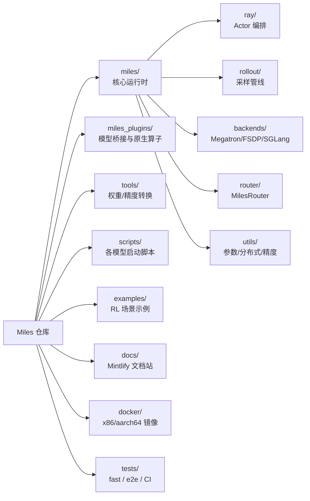

# Miles Wiki

> 一份基于源码阅读生成的 Miles 框架深度 Wiki，全部图示使用 **Mermaid** 绘制。
> Miles 是一个面向大规模模型后训练（Post-Training）的企业级强化学习框架，
> 由 SGLang 提供高吞吐 Rollout、Megatron-LM 提供可扩展训练，并解决训练/推理一致性（Train-Inference Mismatch）问题。

本 Wiki 与官方 `docs/` 互补：官方文档偏「如何使用」，本 Wiki 偏「内部如何运作 + 数据流 + 架构图」。

---

## 阅读地图

| 章节 | 内容 | 关键图示 |
| :--- | :--- | :--- |
| [01 系统架构总览](./01-architecture.md) | 进程模型、Ray 集群、包布局、组件关系 | 进程拓扑图、组件依赖图 |
| [02 训练主循环](./02-training-loop.md) | 同步/异步训练循环、权重同步、显存调度 | 训练时序图、sync vs async 对比 |
| [03 Rollout 管线](./03-rollout-pipeline.md) | 数据源 → 生成 → 过滤 → 奖励 → 训练数据 | Rollout 数据流图、过采样循环 |
| [04 Router 与 R3 路由重放](./04-router-and-r3.md) | MilesRouter 负载均衡、R3 MoE 路由记录与重放 | 请求路由图、R3 记录/重放时序 |
| [05 插件与模型桥接](./05-plugins-and-models.md) | mbridge / models / megatron_bridge 三层架构 | 桥接层级图、模型注册流程 |
| [06 低精度训练](./06-low-precision.md) | FP8 / MXFP8 / NVFP4 / INT4 QAT 全栈 | 精度管线图、兼容性矩阵 |
| [07 RL 算法与损失](./07-algorithms.md) | GRPO/GSPO/PPO/REINFORCE++、OPD、TIS/MIS | 算法分发图、优势估计决策树 |
| [08 多轮交互与 VLM](./08-multi-turn-and-vlm.md) | Session/TITO、多轮、视觉语言模型 | 多轮会话状态图、VLM 采样流 |
| [09 工具链与基础设施](./09-utils-and-tooling.md) | 转换工具、Docker、CI、关键 utils | 转换工具链图、CI 流水线 |
| [10 示例目录导览](./10-examples-map.md) | examples/ 各子目录用途与对应能力 | 示例能力矩阵 |

---

## 项目速览

## 核心设计目标

1. **消除训练-推理不一致**：统一 FP8、R3 路由重放、bit-wise 一致的 log-prob。
2. **极致吞吐**：投机解码、零拷贝权重同步（CUDA IPC）、过采样与部分 rollout 回收。
3. **生产稳定性**：容错、健康监控、检查点恢复、异步安全。
4. **模型与算法多样性**：DeepSeek/Qwen/Llama/GLM/Kimi/Nemotron 等，GRPO/GSPO/PPO/REINFORCE++/OPD 等。

> 入口点：`train.py`（同步）、`train_async.py`（异步）。两者均通过 `miles.utils.arguments.parse_args()` 解析参数后 `asyncio.run(train(args))`。
